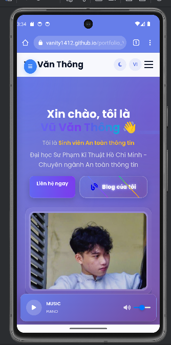
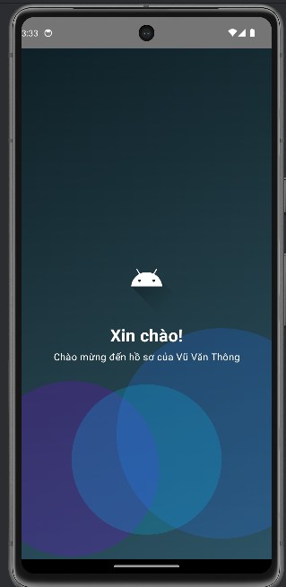
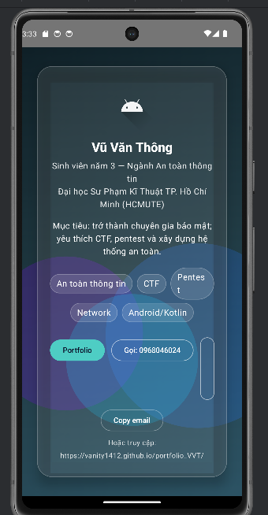

# 📱 Android – Vũ Văn Thông

> Ứng dụng Android giới thiệu **Vũ Văn Thông** – SV năm 3 **Ngành An toàn thông tin, HCMUTE**.  

---

## 🎬 Ảnh chụp màn hình

| Splash | Intro | |gg|
|---|---|
|  |  |    |

---

## 🚀 Cài đặt & Chạy

### Android Studio
1. Clone repo và mở thư mục gốc bằng Android Studio.
2. Chọn **AVD** (Device Manager → Create device…) hoặc **điện thoại thật** rồi **Run ▶**.

---

## 🙋‍♂️ Liên hệ
- **Email**: vuvanthong1708@gmail.com
- **SĐT**: 0968046024

---
