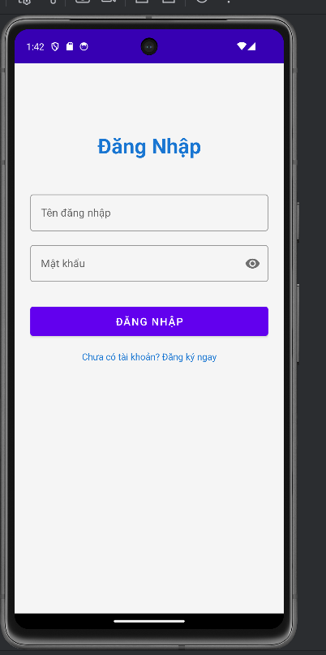
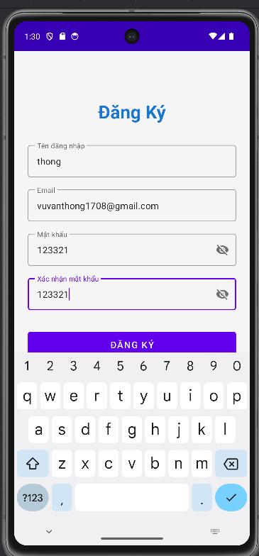
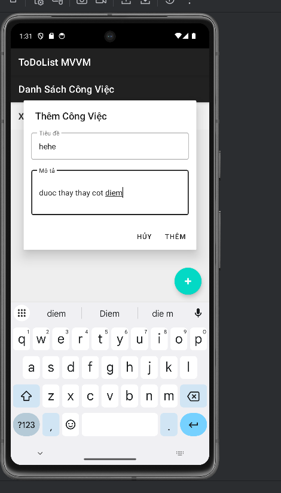
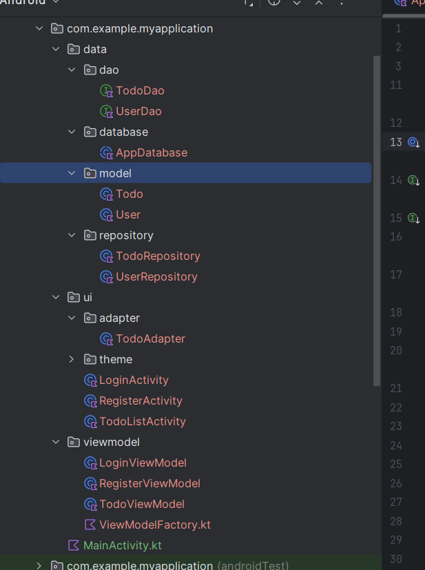

# 📱 ToDoList App - Kiến Trúc MVVM

Ứng dụng quản lý công việc (ToDoList) được xây dựng với kiến trúc **MVVM (Model-View-ViewModel)** sử dụng Kotlin, Room Database, DataBinding và LiveData.

## 📸 Screenshots

<div align="center">
  
  
  
</div>

<div align="center">
  
  
</div>

## 🎯 Tính Năng

- ✅ **Đăng ký tài khoản** với validation đầy đủ
- ✅ **Đăng nhập** xác thực qua SQLite database
- ✅ **Thêm công việc** với tiêu đề và mô tả
- ✅ **Đánh dấu hoàn thành** công việc
- ✅ **Xóa công việc** với dialog xác nhận
- ✅ **Hiển thị thời gian** tạo công việc
- ✅ **Lưu trữ offline** với Room Database

## 🏗️ Kiến Trúc MVVM

```
┌─────────────────────────────────────────┐
│              VIEW LAYER                 │
│  (Activities, XML Layouts, DataBinding)│
└──────────────┬──────────────────────────┘
               │ observe LiveData
               ▼
┌─────────────────────────────────────────┐
│           VIEWMODEL LAYER               │
│  (Business Logic, State Management)     │
└──────────────┬──────────────────────────┘
               │ call repository
               ▼
┌─────────────────────────────────────────┐
│            MODEL LAYER                  │
│  (Data, Repository, Database)           │
└─────────────────────────────────────────┘
```


## 🔧 Công Nghệ Sử Dụng

| Công nghệ | Phiên bản | Mục đích |
|-----------|-----------|----------|
| **Kotlin** | 2.1.0 | Ngôn ngữ lập trình |
| **KSP** | 2.1.0-1.0.29 | Annotation processing |
| **Room** | 2.7.0-alpha10 | SQLite ORM |
| **LiveData** | 2.6.2 | Observable data holder |
| **ViewModel** | 2.6.2 | UI state management |
| **Coroutines** | 1.7.3 | Async operations |
| **DataBinding** | 8.13.2 | Two-way binding |
| **Material Design** | 1.11.0 | UI components |

## 📂 Cấu Trúc Dự Án

```
app/src/main/java/com/example/myapplication/
│
├── 📁 data/
│   ├── 📁 dao/
│   │   ├── UserDao.kt          # Truy cập dữ liệu User
│   │   └── TodoDao.kt          # Truy cập dữ liệu Todo
│   │
│   ├── 📁 database/
│   │   └── AppDatabase.kt      # Room Database
│   │
│   ├── 📁 model/
│   │   ├── User.kt             # Entity User
│   │   └── Todo.kt             # Entity Todo
│   │
│   └── 📁 repository/
│       ├── UserRepository.kt   # Repository User
│       └── TodoRepository.kt   # Repository Todo
│
├── 📁 ui/
│   ├── 📁 adapter/
│   │   └── TodoAdapter.kt      # RecyclerView Adapter
│   │
│   ├── LoginActivity.kt        # Màn hình đăng nhập
│   ├── RegisterActivity.kt     # Màn hình đăng ký
│   └── TodoListActivity.kt     # Màn hình danh sách
│
└── 📁 viewmodel/
    ├── LoginViewModel.kt       # ViewModel đăng nhập
    ├── RegisterViewModel.kt    # ViewModel đăng ký
    ├── TodoViewModel.kt        # ViewModel quản lý todo
    └── ViewModelFactory.kt     # Factory pattern
```

## 🚀 Hướng Dẫn Cài Đặt

### Yêu Cầu

- Android Studio Hedgehog (2023.1.1) trở lên
- JDK 11 trở lên
- Android SDK API 24+ (Android 7.0)
- Gradle 8.13+

### Các Bước Cài Đặt

1. **Clone repository**
```bash
git clone <repository-url>
cd btap11
```

2. **Mở project trong Android Studio**
```
File > Open > Chọn thư mục dự án
```

3. **Clean project**
```bash
./gradlew clean
```

4. **Invalidate Caches** (Khuyến nghị)
```
File > Invalidate Caches / Restart... > Invalidate and Restart
```

5. **Sync Gradle**
```
File > Sync Project with Gradle Files
```

6. **Build project**
```bash
./gradlew assembleDebug
```

7. **Run app**
- Kết nối thiết bị Android hoặc khởi động emulator
- Nhấn Run (Shift + F10)


## 💡 Cách Sử Dụng

### 1. Đăng Ký Tài Khoản


- Mở app lần đầu
- Nhấn "Chưa có tài khoản? Đăng ký ngay"
- Nhập thông tin:
  - Tên đăng nhập (không trùng)
  - Email
  - Mật khẩu (tối thiểu 6 ký tự)
  - Xác nhận mật khẩu
- Nhấn "Đăng Ký"

### 2. Đăng Nhập


- Nhập tên đăng nhập và mật khẩu
- Nhấn "Đăng Nhập"
- Chuyển sang màn hình danh sách công việc

### 3. Quản Lý Công Việc


**Thêm công việc:**
- Nhấn nút FAB (➕) ở góc dưới bên phải
- Nhập tiêu đề và mô tả
- Nhấn "Thêm"

**Đánh dấu hoàn thành:**
- Nhấn checkbox bên trái công việc
- Tiêu đề sẽ bị gạch ngang

**Xóa công việc:**
- Nhấn nút xóa (🗑️) bên phải
- Xác nhận xóa trong dialog

## 🎓 Giải Thích MVVM

### Model (Dữ liệu)

```kotlin
@Entity(tableName = "todos")
data class Todo(
    @PrimaryKey(autoGenerate = true)
    val id: Int = 0,
    val userId: Int,
    val title: String,
    val description: String,
    val isCompleted: Boolean = false,
    val createdAt: Long = System.currentTimeMillis()
)
```

### View (Giao diện)

```xml
<layout>
    <data>
        <variable name="viewModel" 
                  type="...LoginViewModel" />
    </data>
    
    <EditText
        android:text="@={viewModel.username}" />
</layout>
```

### ViewModel (Logic)

```kotlin
class LoginViewModel(private val repository: UserRepository) : ViewModel() {
    val username = MutableLiveData<String>()
    val password = MutableLiveData<String>()
    
    private val _loginResult = MutableLiveData<LoginResult>()
    val loginResult: LiveData<LoginResult> = _loginResult
    
    fun login() {
        viewModelScope.launch {
            val user = repository.loginUser(username.value!!, password.value!!)
            _loginResult.value = LoginResult.Success(user)
        }
    }
}
```


## 📊 Database Schema


### Bảng Users
```sql
CREATE TABLE users (
    id INTEGER PRIMARY KEY AUTOINCREMENT,
    username TEXT NOT NULL,
    password TEXT NOT NULL,
    email TEXT NOT NULL
);
```

### Bảng Todos
```sql
CREATE TABLE todos (
    id INTEGER PRIMARY KEY AUTOINCREMENT,
    userId INTEGER NOT NULL,
    title TEXT NOT NULL,
    description TEXT NOT NULL,
    isCompleted INTEGER NOT NULL DEFAULT 0,
    createdAt INTEGER NOT NULL,
    FOREIGN KEY (userId) REFERENCES users(id)
);
```

## 🔄 Luồng Dữ Liệu

### Đăng Nhập

```
User nhập thông tin
    ↓
DataBinding → ViewModel.username/password
    ↓
User nhấn "Đăng Nhập"
    ↓
ViewModel.login() (Coroutine)
    ↓
Repository.loginUser()
    ↓
UserDao.login() (Room Query)
    ↓
LiveData<LoginResult>
    ↓
Activity observe → Navigate
```


### Thêm Todo

```
User nhấn FAB
    ↓
Dialog hiện ra
    ↓
User nhập tiêu đề, mô tả
    ↓
ViewModel.addTodo() (Coroutine)
    ↓
Repository.insertTodo()
    ↓
TodoDao.insertTodo() (Room Insert)
    ↓
LiveData<List<Todo>> tự động cập nhật
    ↓
RecyclerView tự động refresh
```


## 🎨 UI Components

### Material Design 3

- **TextInputLayout**: Input fields với outline style
- **MaterialButton**: Buttons với ripple effect
- **MaterialCardView**: Cards cho todo items
- **FloatingActionButton**: FAB để thêm todo
- **RecyclerView**: Danh sách scrollable
- **AlertDialog**: Dialogs cho xác nhận


## 🧪 Testing

### Unit Tests (ViewModel)

```kotlin
@Test
fun `login with empty username should return error`() {
    viewModel.username.value = ""
    viewModel.password.value = "123456"
    viewModel.login()
    
    val result = viewModel.loginResult.value
    assertTrue(result is LoginResult.Error)
}
```

### Integration Tests (Repository)

```kotlin
@Test
fun `insert and retrieve todo`() = runBlocking {
    val todo = Todo(userId = 1, title = "Test", description = "Test")
    repository.insertTodo(todo)
    
    val todos = repository.getTodosByUser(1).getOrAwaitValue()
    assertEquals(1, todos.size)
}
```

## 📚 Tài Liệu Bổ Sung

- 📖 [README_MVVM.md](README_MVVM.md) - Giải thích chi tiết MVVM
- 📖 [HUONG_DAN_SU_DUNG.md](HUONG_DAN_SU_DUNG.md) - Hướng dẫn sử dụng
- 📖 [BUILD_INSTRUCTIONS.md](BUILD_INSTRUCTIONS.md) - Hướng dẫn build
- 📖 [KSP_VS_KAPT.md](KSP_VS_KAPT.md) - So sánh KSP và KAPT
- 📖 [PROJECT_SUMMARY.md](PROJECT_SUMMARY.md) - Tóm tắt dự án

## ⚠️ Troubleshooting

### Lỗi: "Module was compiled with an incompatible version"

**Giải pháp:**
```bash
./gradlew clean
rm -rf .gradle build app/build
./gradlew assembleDebug
```

### Lỗi: "Cannot find symbol"

**Giải pháp:**
1. File > Invalidate Caches / Restart
2. Build > Rebuild Project
3. Kiểm tra `build/generated/ksp/`

### Lỗi Build

**Giải pháp:**
- Đảm bảo Kotlin version = 2.1.0
- Đảm bảo KSP version = 2.1.0-1.0.29
- Đảm bảo Room version = 2.7.0-alpha10

## 🔮 Tính Năng Tương Lai

- [ ] Authentication với JWT token
- [ ] Sync với server (Retrofit + API)
- [ ] Push notifications cho reminders
- [ ] Dark mode support
- [ ] Export/Import dữ liệu (JSON, CSV)
- [ ] Categories và tags cho todos
- [ ] Search và filter nâng cao
- [ ] Widget cho home screen
- [ ] Backup tự động lên cloud

## 📄 License

```
MIT License

Copyright (c) 2024

Permission is hereby granted, free of charge, to any person obtaining a copy
of this software and associated documentation files (the "Software"), to deal
in the Software without restriction...
```

## 👨‍💻 Tác Giả

- **Tên**: [Your Name]
- **Email**: [your.email@example.com]
- **GitHub**: [github.com/yourusername]

## 🙏 Acknowledgments

- [Android Developers](https://developer.android.com/)
- [Kotlin Documentation](https://kotlinlang.org/docs/)
- [Room Persistence Library](https://developer.android.com/training/data-storage/room)
- [Material Design](https://material.io/design)

---

<div align="center">
  
  
  **ToDoList MVVM App**
  
  Made with ❤️ using Kotlin & MVVM
</div>

